### Nombre del Proyecto
##  API - Centro Médico con SpringBoot

# Tabla de Contenido
1. [Información General](#general-info)
2. [Autores](#autores)
3. [Funcionalidades API](#funcionalidades)
4. [M.E.R Centro Médico](#MER)


# General Info
***
Ejercicio para aprendizaje creación API REST con SpringBoot, MySql, para realizar pruebas de end-points, se puede utilizar el archivo request.http instalando REST Client. 

# Instalación y ejecución APP:

**1. Clone este repositorio ejecutando el siguiente comando: -**

```bash
 git clone "https://github.com/AndresVillamil/api-citas-springboot.git"
 cd api-citas-springboot
```

**2. ** **🎉 Abrir postman and probar el API en esta url `https://127.0.0.1:8081`**


Adicionalmente este proyecto utiliza:

- [Spring Boot](https://springboot.io)


# Autore(s):
***
## Edwin Andrés Villamil Laverde. 
## Programa - DESARROLLO WEB BACK END – INTERMEDIO GRUPO 01
## Universidad Distrital Francisco José de Caldas

# :hammer:Funcionalidades del proyecto
***
- `Gestión de Pacientes`: Permite la creación, búsqueda, modificación y eliminación de pacientes.
***
-  Crear un Paciente
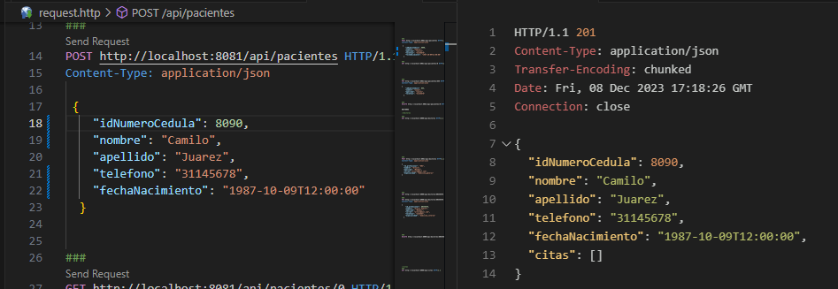

-  Obtener Listado de Pacientes
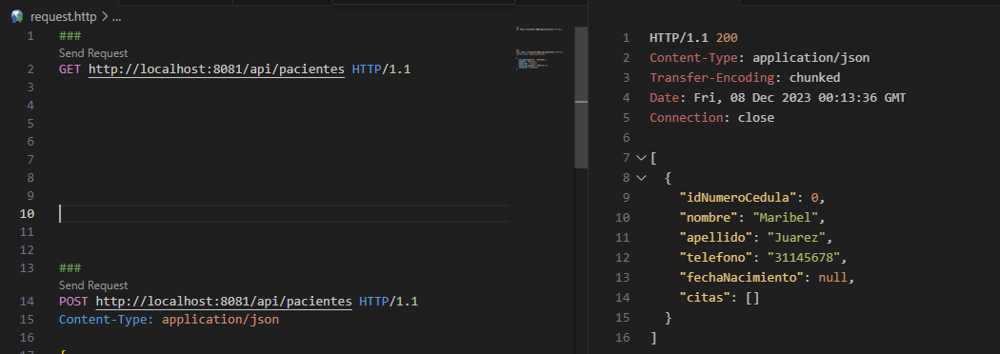

-  Modificar un Paciente por ID
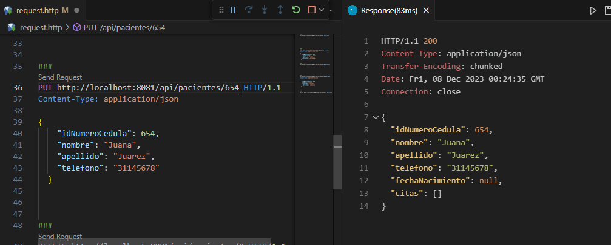

-  Eliminar un Paciente
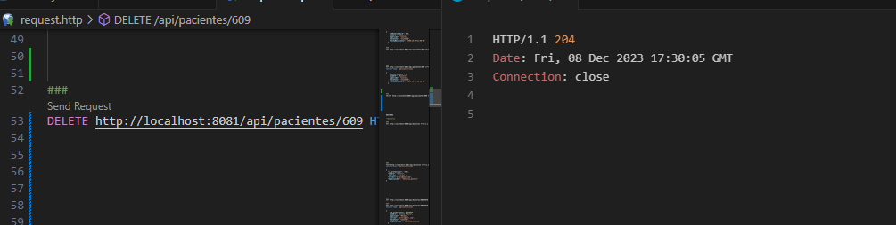

- `Gestión de Doctores`: Permite la creación, búsqueda, modificación y eliminación de doctores.
***
-  Crear un Doctor
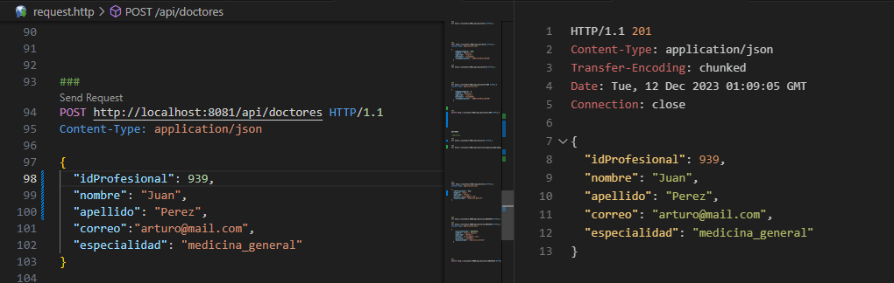

-  Obtener Listado de Doctores
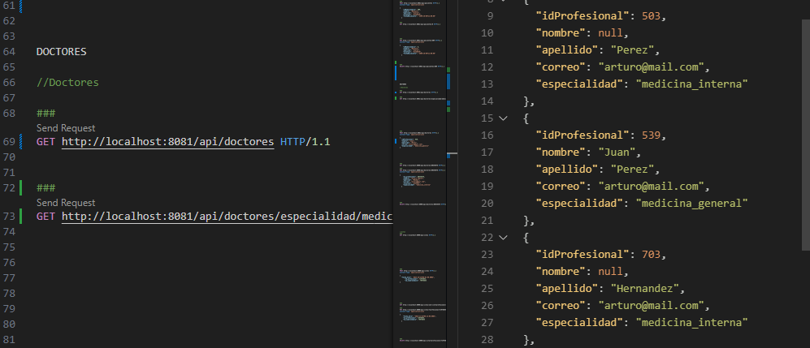

-  Modificar un Doctor por ID
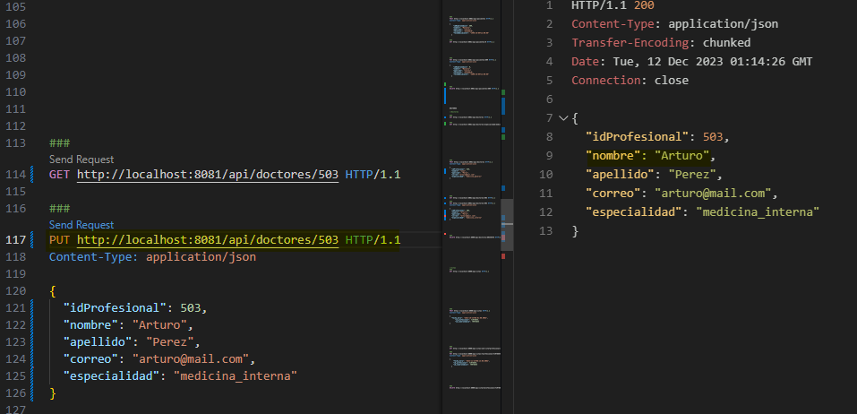

-  Eliminar un Doctor
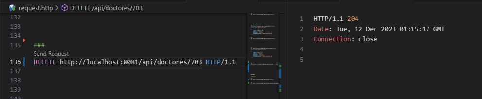


- `Gestión de Citas`: Permite la creación, búsqueda, modificación y eliminación de citas.
***
-  Crear una Cita
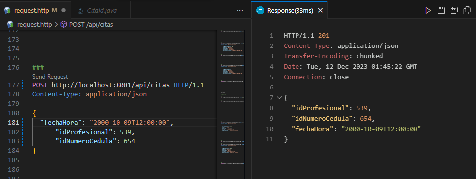

-  Obtener Listado de Citas
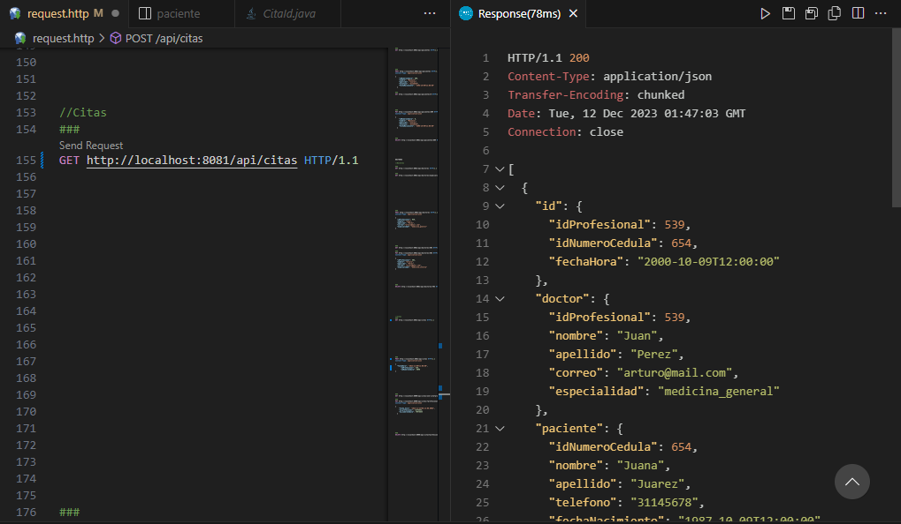

-  Obtener una Cita por ID
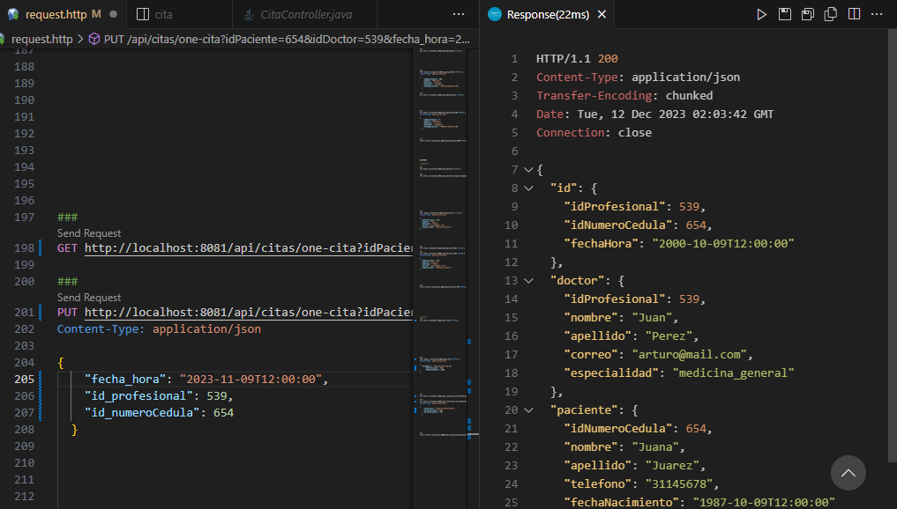


### Imagen de Modelo Entidad Relación - Centro Médico
***

